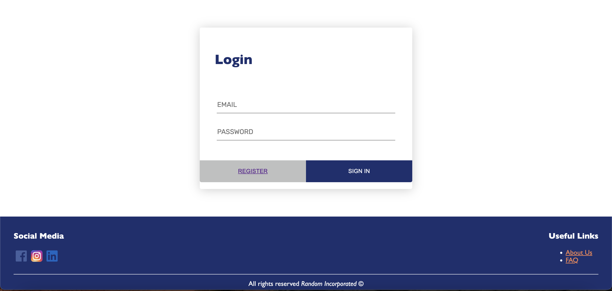

# An E-commerce Application

This is a simple E-commerce Application as homework for "Biznesi dhe Interneti" at FSHMN.  
  
The frontend is in HTML, CSS, and minimal JavaScript while the backend is in PHP. The data is stored in a MySQL database. Aside from the provided libraries inside of PHP, PHPMailer was used for sending emails.

## Running the application
If you follow the below instructions, the application should run perfectly:

### Setting up the database and server
Set up XAMPP or MAMP on your machine and copy this project in the `htdocs` folder and name it `ecommerce` - that should be enough for the server. Assuming that you started `mysql` from XAMPP, run the `db/schema.sql` in MySQL to create the database structure. If this succeeds, run `db/data.sql` in MySQL to populate the database with some example products and categories. This last one will also create a test user with the following credentials:

- Email: filan@fisteku.com
- Password: ecommerce123

Finally go to `includes/db_connect.php` and change the username and password for logging into your database.

### Setting up PHPMailer
Go to the file `includes/mail_config` and set the correct host, port, username, and password for your SMTP server. In our case, we're using [Mailtrap IO](https://www.mailtrap.io) for testing purposes.
  
With these set, start your server and visit `/ecommerce` in your browser.

## Application Features

The application includes the following features.

### View and filter products
The main page `index.php` lists all the products available in the store for purchase. By design, there is an unlimited supply of items for purchase. All the products are divided into categories and subcategories. The main page allows filtering the products by category, subcategory, and by search. These are all chained together to narrow down the results. Clicking on an item opens a new page where the product can be viewed along with its description and price. At the bottom of the page, a "Add to cart" button is seen, which, when clicked, redirects the user to the login screen since only authenticated users can make purchases.

### Authentication
A user can create a new account in the `register.php` page, after which they will get a confirmation email in their inbox. After confirming the email, they will be able to log in their account through the `login.php` page. This will give them the ability to add items to their cart and make purchases. Keep in mind that authentication is secure, the password is hashed on the database, and that error messages are displayed correctly. On the page header there is a logout button which logs the user out when it is clicked.

### Adding items to the cart
The header of the screen changes when a user logs in. What before used to say "Log in" now contains a few buttons along which is the "Cart" button which looks like a cart. When adding items to the cart, a notification is seen on the cart button which indicates the number of products added to the cart at the moment. This is updated each time we add or remove something from the cart.  
Clicking on the cart button brings us to the cart page. This page lists the products, quantities, and total price for the items. The quantity can be changed directly or a product can be removed completely if the user desires to do so. If the user is satisfied with the products they have chosen, they can click "Checkout".

### Checking out
The checkout page contains a form to be filled by the user for their card information. The form actually looks like a card and validates the user's input. When the user finally clicks "Pay" an email with the receipt is sent to their email and the payment is confirmed.

### Profile details
On the header there is also a "Profile" button which links to the user profile page. On this page the user can view and edit his address information as well as their profile picture directly.

## Screenshots

